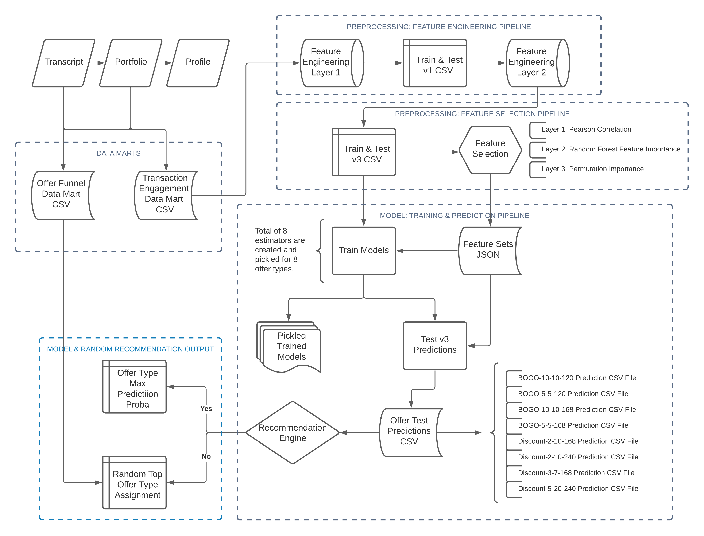

# Starbucks Capstone Project
### Udacity Machine Learning Engineer Nanodegree

> Predicting the best offer type for every customer with the highest probability of completion.

---

## Main Project Files

- Starbucks_Capstone_Project.pdf
- Starbucks_Capstone_Project.ipynb

## Description

- Using the raw JSON files (transcript, profile, and portfolio), the goal is to create a supervised classification model for every offer type (e.g., BOGO-10-10-120) that can predict if a customer will complete an offer or not.
- Eight random forest models are trained and saved, where each model predicts the completion of a single offer type by a customer.
- The end-to-end model pipeline identifies the positive predictions, and the offer with the highest prediction probability is selected as the winner.
- Customers who receive all negative predictions are assigned a random offer from top four performing offers.

## Full Pipeline Design

## Dev Environment

- PyCharm
- Python 3.7.*
- conda environment: `environment.yml`

## Execution Setup

| Directory Name | Script Name | Description |
| ---- | ---- | ----------- |
| base_transforms | base_transforms_df.py | Contains class object to create base dataframes. |
| datamarts | datamart_offer_funnel_view.py | Offer funnel data mart. |
| datamarts | datamart_transaction_engagement.py | Transaction engagement data mart. |
| preprocessing | preprocessor_feat_engine_layer_1.py | Feature engineering to produce train and test v1. |
| preprocessing | preprocessor_feat_engine_layer_2.py | Feature engineering to produce train and test v3. |
| preprocessing | preprocessor_feat_select_pipeline.py | Feature selection to identify most important features per offer type. |
| train_predict_recommend | model_train_predict_pipeline.py | The script trains models using train v3 sets, generates predictions using test v3 sets, and pickles the trained models.  |
| train_predict_recommend | model_make_recommendation_pipeline.py | The script takes the saved test predictions and decides on the best offer (offer with the highest prediction probability) for each customer. |
| -- | output_model_stats.py | Generates model diagnostic metrics as well as diagnostic plots using train and test sets. |

